Years 2020, 2021 and 2022 have been tough for almost everyone. The pandemic, the war, global economic collapse, bancruptcies in Crypto sphere... You name it.
Although, for me it was a rather productive period(despite a divorce spanning almost 3 years), since I have accustomed to working from home and working on various project remotely. The range of projects varied from working on a system that tailors advertisements to people behavior to optimizing Internet traffic by cleverly and autonomously arranging relay nodes all around the globe.
All these projects mainly keep the food on my table and fund my other, more experimental, theoretical or sometimes even absurd ideas.

During these challenging times I had an opportunity to work on different flavors of full stack engineering and development. At last had time and purpose to learn Go and play around with Rust.
Also, got more experience with EasyEDA, switched from OpenSCAD to FreeCAD. Discovered TinyGo and used it for several embedded projects with great success.
Experimented with SPA(Single Page Application) using React and even Go compiled to WASM([Fyne](https://github.com/fyne-io/fyne) and directly manipulating DOM using [React-like framework](https://github.com/hexops/vecty)).
I'll highligh several projects that I've been working long term and some updates on previous projects.

# Cingulate-art
This is actually a project with so much hope, but with a sad outcome. 
Basically, I've setup a web store that allows you to generate AI art using your own provided pictures. It is something similar to style transfer, but with 
much more added effects, filters, etc.


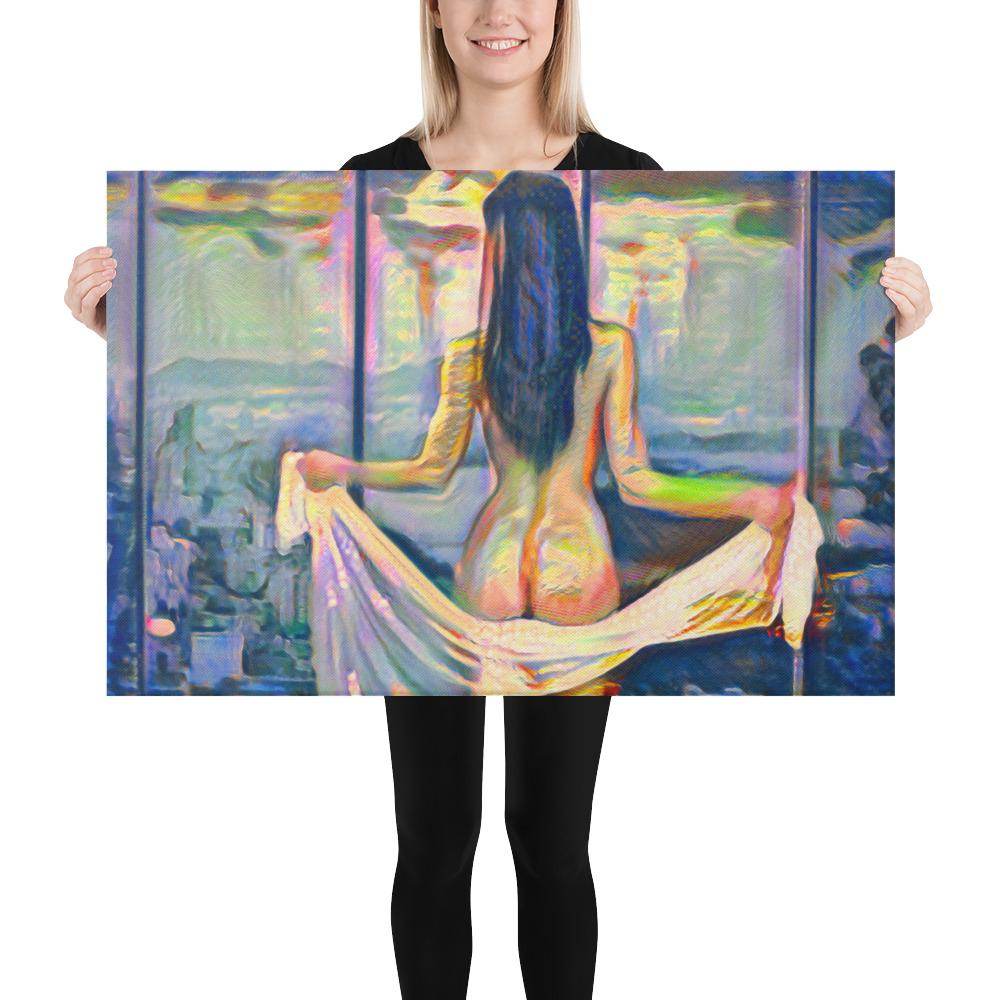

Sadly, I couldn't find a market for it, properly advertise it or even drive enough traffic to it. So I had to kill it after more than two years of SEO, Link building and social marketing...
However, I have learned so much during this time about actual marketing, SEO and running your own Shopify store(I had several actually that helped to somewhat reduce the lost investments) :)

# ESPReflow
There was very little progress here(Although, to be fair, I haven't even written a post about this project). Mainly due to the fact, that the prototype was being successfully used for PCB baking and there was little need to improve anything.
Although, there are some bugs here and there, the code does what I want it to do. Some people even were able to replicate the project.

However, I have designed a second prototype board, succesfully tested it and put it aside for a bit. I need to rethink thermals as well as UX.
The plan, of course, is to turn it into a product.

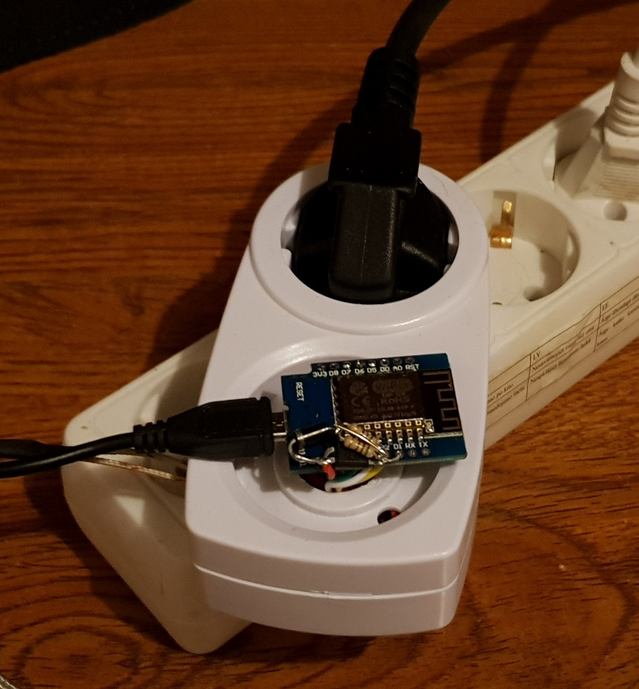


# ESPMotion
This project died out after I've designed a PCB, soldered everything and started testing. Something got me distracted from this project and I never really got back to it.
(The cat run away, so basically I had noone to use this project for...)

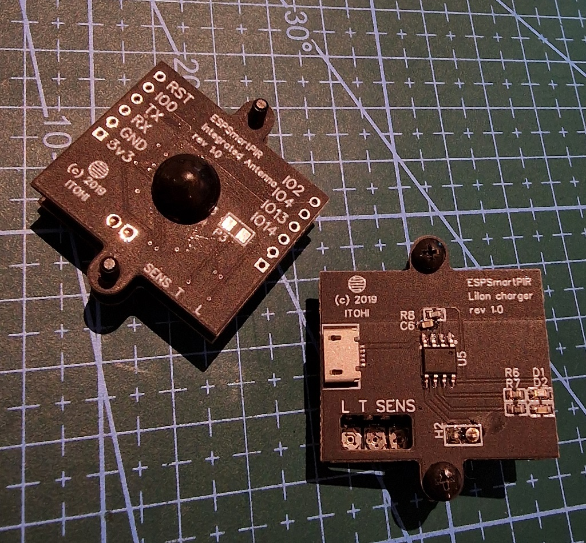

# ESPWeather
I am still thinking about this one. I have sold a few boards on Tindie. There were no complaints and no further interest though.
Although, I have been working on a more sophisticated board that allows to connect various I2C devices and even RS232 logger. Oh, And, also, It has a potential to 
actually measure rain fall by using this:


# EasyRobot
The purpose of this project is to be able to quickly spin up an autonomous modular robot, that could have its brains literally scattered around the world.
In other words, it implements a decentralized robotics framework that uses NATS for communication between modules.

The testbed for this platform is:
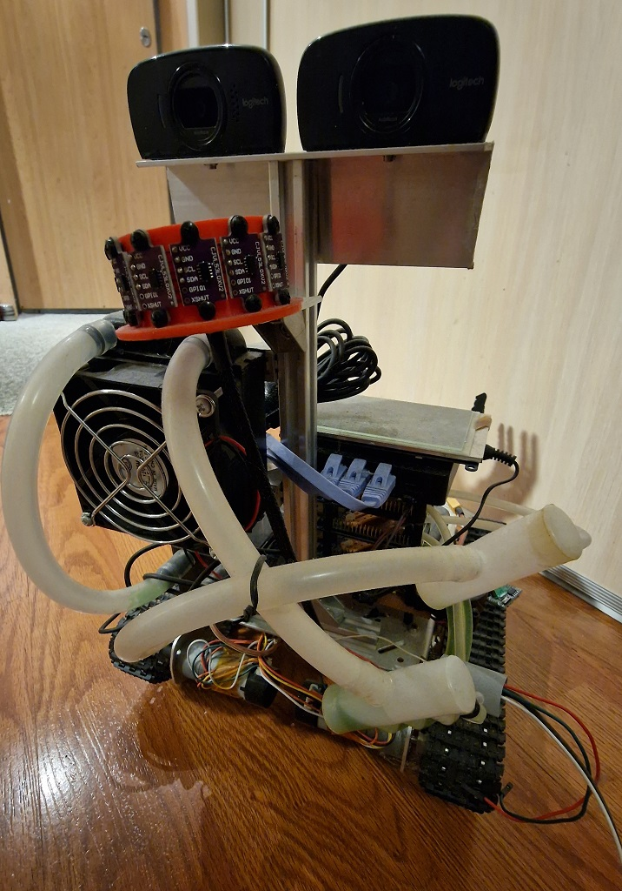
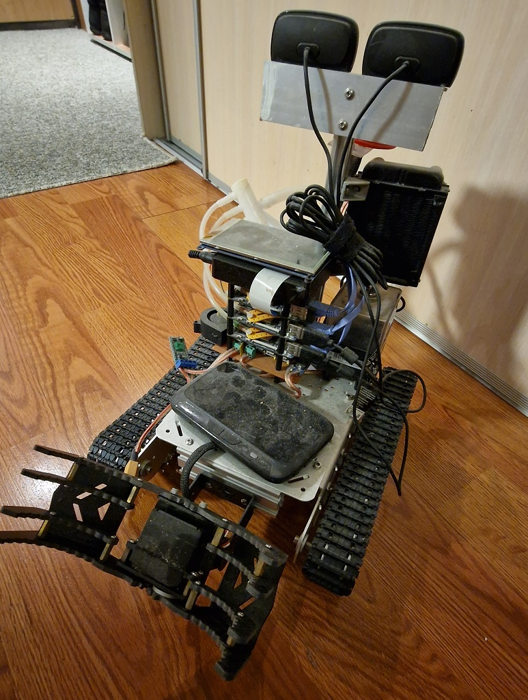

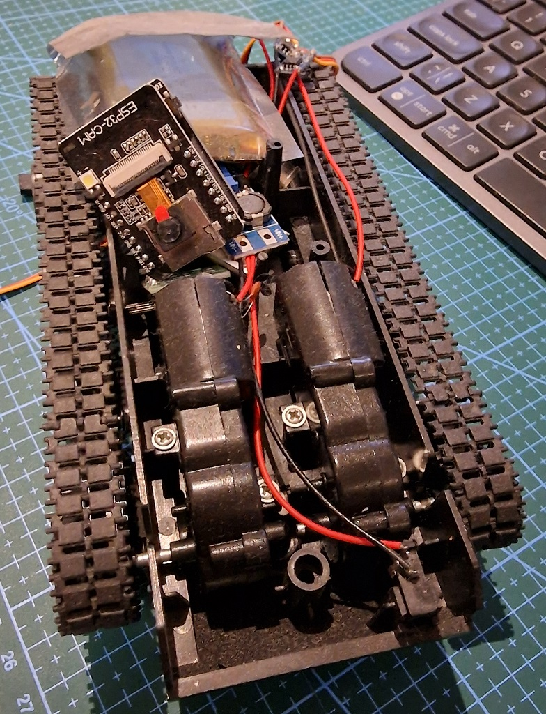

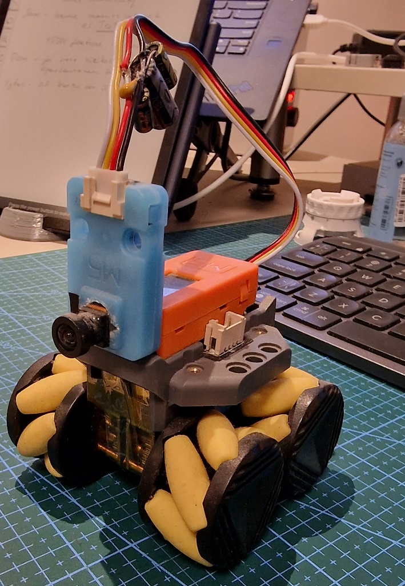


The initial implementation was written in C++ and consisted of various motion drivers, Forward/Inverse Kinematics engine, some algebra and even a Neural Network engine. Later, I decided
to port everything to Go. This is a slowly burning project that I contribute to when I have time and/or inspiration.

I'll be posting some of the status updates on the whole project separately. Mostly that will involve topics about Deep NN architecture for depth estimation, visual odometry and online semantic map building.

# FishFeeder
Caring for fish with my ADHD brain is rather challenging task. Therefore I've built this little fish tank reminder:


Actually, it is a variation on my other project [Healthy Nudges](https://github.com/itohio/HealthyNudges), but embedded. The [code](https://github.com/itohio/FishFeeder) is written in Go and uses little neat M5Stick module.
It reminds me to feed the fish, do water changes and perform filter maintenance. The nudger is easily configurable:

```
	iconImages    = [][]uint16{
		icons.FoodPng,
		icons.AquariumPng,
		icons.FilterPng,
	}

	colors = []color.RGBA{
		{G: 8},
		{B: 8},
		{R: 8},
	}

	nudges = []Nudge{
		{
			timestamp: time.Now(),
			delay:     time.Hour * 24,
			nudge:     makeNudge(colors[0], icons.FoodPng),
		},
		{
			timestamp: time.Now(),
			delay:     time.Hour * 24 * 7,
			nudge:     makeNudge(colors[1], icons.AquariumPng),
		},
		{
			timestamp: time.Now(),
			delay:     time.Hour * 24 * 30,
			nudge:     makeNudge(colors[2], icons.FilterPng),
		},
	}
```

That is all there is :)
However, the button functions are a bit more complicated and are designed to actually feed the fish. E.g. you can either just tread the fish or feed. The treat is like one portion of the food that can be dispensed whenever. While the feeding is usually initiated when the nudge is active by long-pressing the main button.

In all fairness, this is one of the most useful tools I've built for myself :)

# Healthy Nudges
This is an attempt to learn Fyne - a framework for creating GUI applications in Go. I really like those apps that nudge you to take abreak from work. However, I find that most of them aren't really portable and somewhat lack in configurability.

Therefore I've created this one.

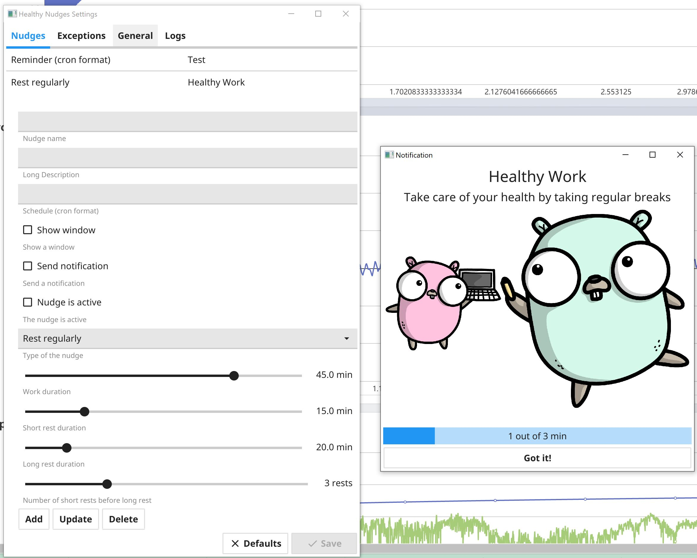

The interface allows you to setup different nudges with different rules. Also, You can specify how obstructive they are. 
I postponed this project until Fyne implemented some needed features(such as System Tray support, etc) and will return to it at some point.

# Coin Watcher
This is another project that I used as an excuse to learn more about Fyne. It allows you to setup a list of coins to monitor.
There are two possible sources of the price data: Coinmarketcap or CoinGeko.


I kind of abandoned this project, since I'm actually using various services that do that for me and provide much more features.

# Phingo
The purpose of this project is to help me generate invoices automatically, rather than using Google Sheets and copy stuff...
The idea, so far, is to write invoice templates in Markdown that would be converted into PDF. Also, this app would act as a balance sheet for the business and would help with accounting
when the time to pay taxes comes.

The reason I'm not working on it as much as I'd like is simple: most of my income is in Crypto currently, therefore I can use online tools that track all the transactions and generate tax forms for me automatically. I don't actually have to write anything into anywhere myself(This is what I was aiming for with Phingo actually).

However, I still want to be able to generate beautiful invoices automatically. Maybe even turn this app into online app (using Fyne and Webasm!) and perhaps even find paying users.
The things that I'm still thinking about:

- how to make it trustless - the goal is to store all the user data in the database encrypted. Username and password would be actually the private key to decrypt the data on the frontend!
- How to cover all the possible invoice types - I should probably stop thinking about that if I want to make progress.

# Acoustics
This is actually the next big thing on my radar. I've been obsessing with audio quality for quite some time.
Due to the vastness of the topic this deserves a separate sequence of posts. However, just to induce some appetite, here are some teasers:

## Speaker measurement rig
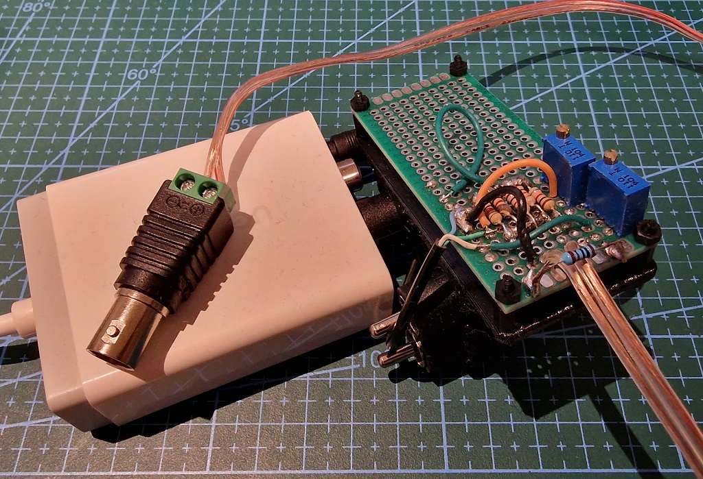

Now I can measure speaker impedance using REW!

I'll be building a fully-contained Raspberry-Pi speaker measurement rig that I could take with me when potentially buying used speakers.

## Surround sound home theater
The electronics consist of:
- 5.1 cheap receiver from Aliexpress - I simply needed a Toslink -> 5.1 audio converter.
- 6x50w+2x100W+100W power amplifier based on TPA3116D2
- MiniDSP 8x10 DSP board
- Refactored 60W soundbar acting as a center speaker (threw away the electronics)
- 2x Radiotehnika S250 speakers: filters removed and 3 sets of connectors added for three-amping
- Radiotechnika speakers woofer act as both the sub and low frequency woofer
- 50W Bass shaker screwed to the bottom of the couch - arguably the best addition I've made to the home theater!
- 2x3" speakers in Open Baffle configuration from Aliexpress acting as surround speakers
  


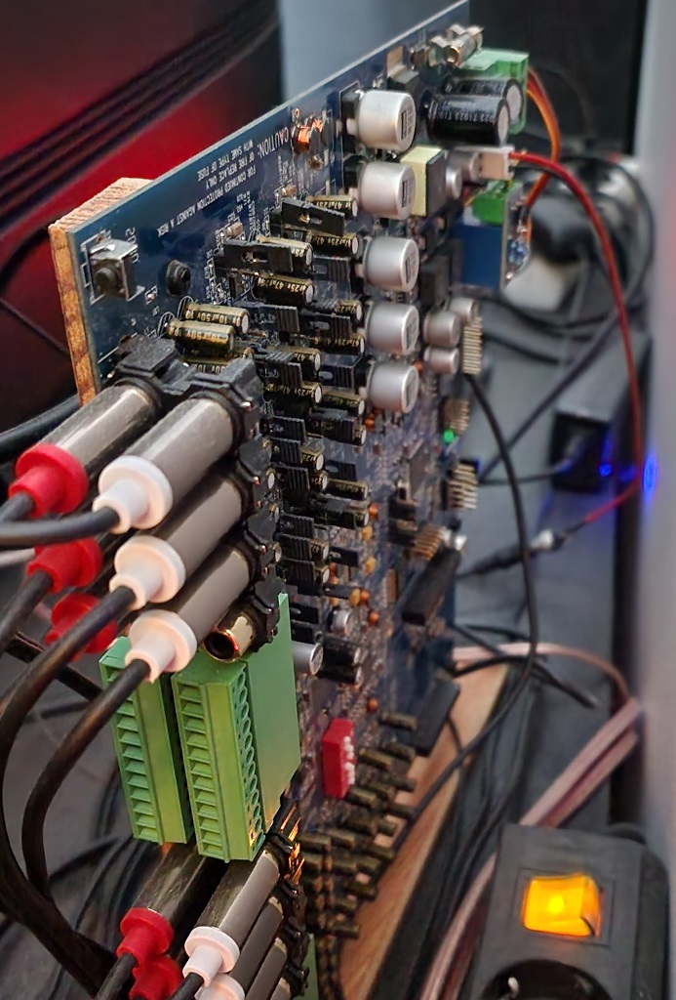


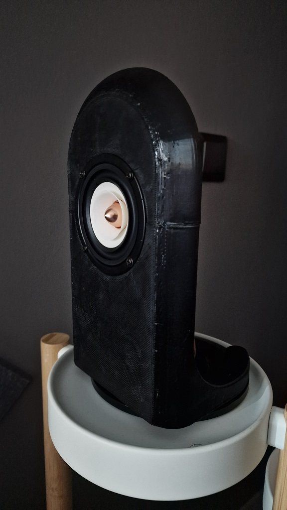


Now, I can literally Netflix & Chill!

## Surround sound for my work place
The electronics consist of:
- ... and ... as Surround processors
- STM32 as controller and UX
- 5x50W+100W power amplifier based on TPA3116D2
- for the speakers I have 3D printed open baffles for all six speakers
- for the sub I'm using a 10"(I think) cheap car ported sub
- I have found that the sub works better in my small room when the port is plugged
- Measured the response with REW and corrected delays and frequency responses with APO Equalizer...

By the way, in comparison with boxed speakers(~15W speakers from Creative 5.1 set) I am much much more satisfied with the sound of open baffles, even though I'm running them in a non-optimal way.

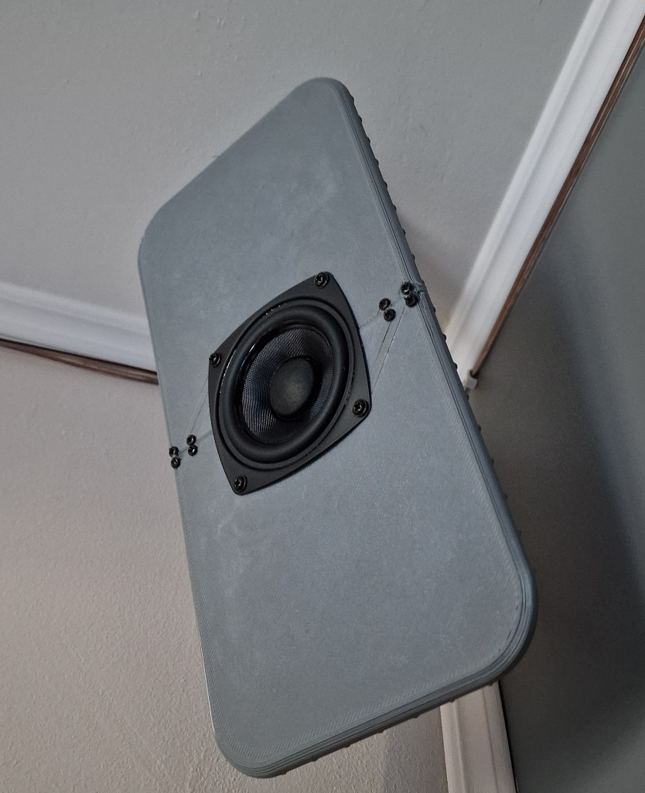
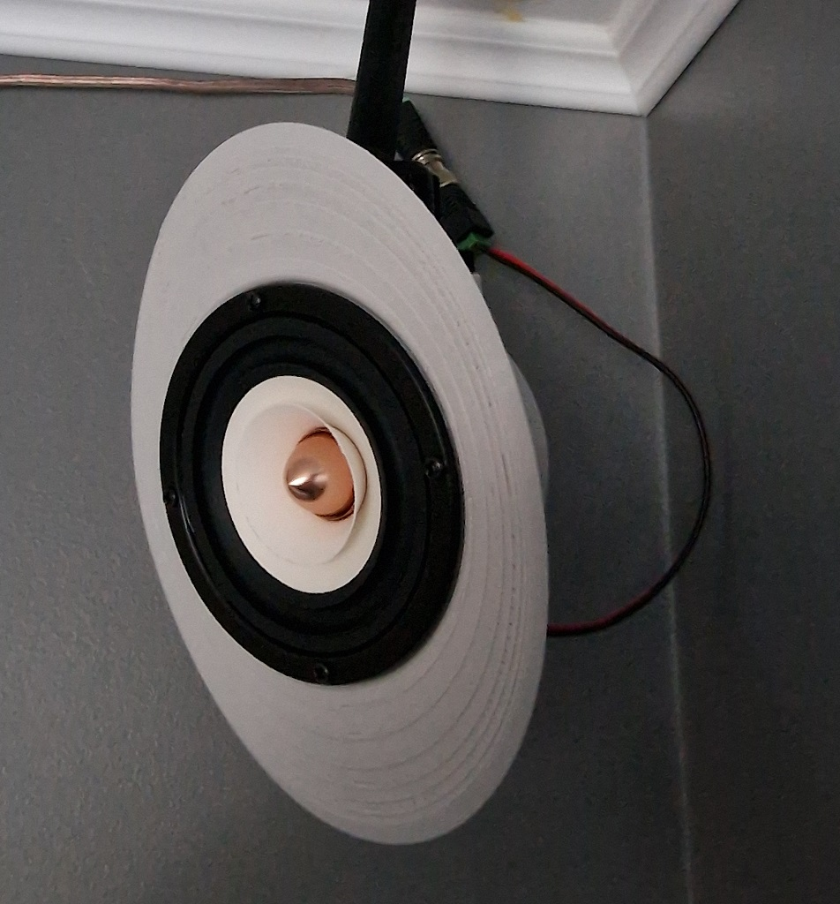
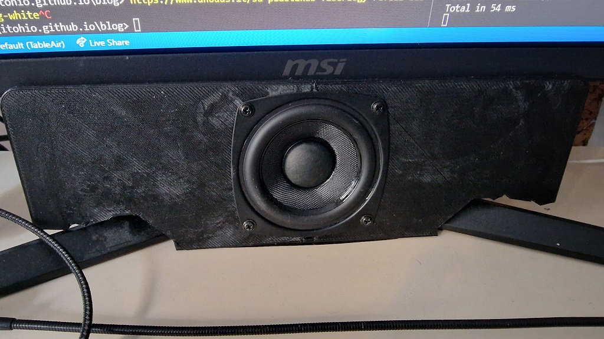

As you can see, the front and surround speakers are in the corners... However, with properly configured delays I am able to place the scene more or less where I want!

The reason for the Open Baffle is three-fold:
- I wanted to experiment
- I was designing enclosures that I could print with 150x150x150 print volume... And figured, that Open Baffle would be the easiest to print with PET-G :)
- I got tired of enclosure resonances and port wooshings (even though I have reduced power at those frequencies.. )

Well, I am aware of this whole argument audiophiles make, that measurement equipment cannot measure certain characteristics of the audio reproduction system... And as a physicist I am sceptical of special cables, oxigen-free cables, speaker risers, etc., etc...

HOWEVER, when performing measurements of the OpenBaffle(Well, I had to make sure that my speaker is better than the old one before actually comitting to the whole idea of replacing them!) and the old Creative speakers, I could actually **hear** the difference with my tone-deaf ears. And it wasn't flattering to the super-duper optimized Creative plastic speakers! The most important thing is, that I couldn't really see the noises that I was hearing neither on the frequency response, distortion graphs, nor on the waterfalls. Even though, with respect to distortions, the Open Baffle speakers win by a few dB, however, that is mostly due to the fact that these drivers are larger and overall better(BTW, Daytone 3" drivers are much better than Aliexpress ones).

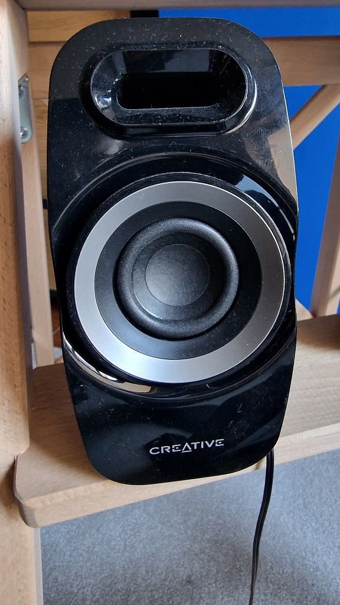

Overall, I mostly belive that the most important factors to sound clarity and quality are these:
- room acoustic treatment
- speaker placement

## The next steps
I am currently working on ADAU1456-based implementation of the amplifier and DSP(so that I could turn off APO for the main setup), where the whole audio tract would be completely digital!

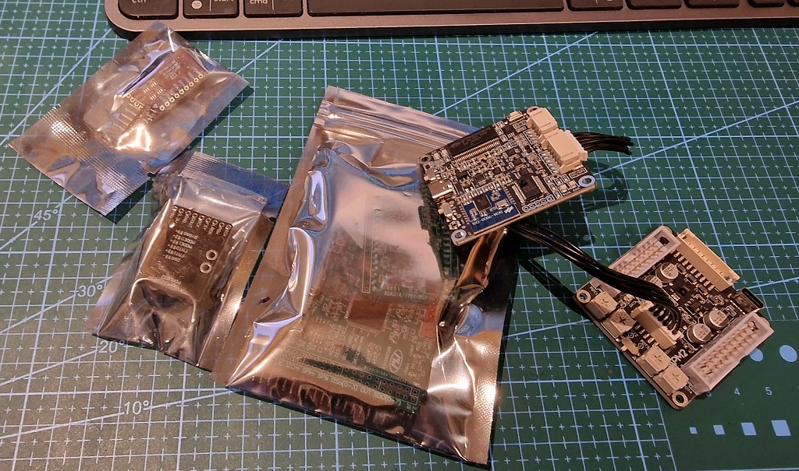

Also, I'm working on a RAM(Room Acoustics Measurement - the name is work in progress) application that would be open-source variant of REW with a few interesting features:

- It would be able to generate certain test signals
- The test signals would be coded so that the analyzer part of RAM would be able to figure out what kind of measurement was requested

That would allow for a very intersting usecase - e.g. you could play the recording on a radio station and someone else somewhere else would be able to receive it,
analyze it, and generate a report about the media frequency and phase characteristics...
I have almost finished the core of the application and am working on the UX/UI part. Since the whole project is written in Go, I think, it will be possible to host the whole application as a SPA app using WASM!


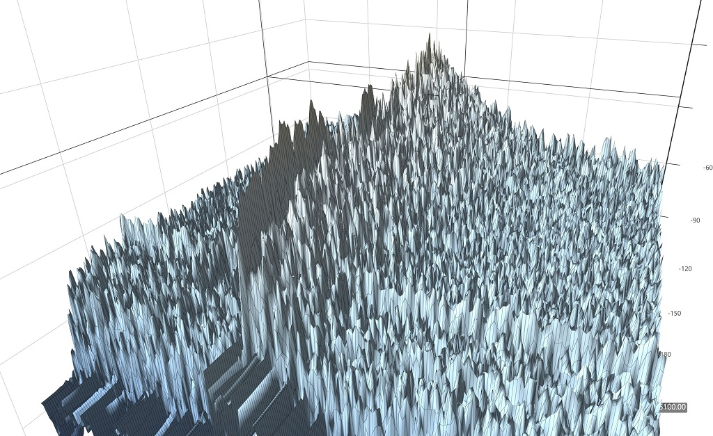

NOTE: The waterfall diagram shows frequencies reversed, basically the lower the frequency the farther away is the peak from the viewer. Also, frequency and the waterfall graphs
show the RAW values(basically sub-hertz resolution), hence so much noise(comb-filtering as well as untreated room response). The most value of this app can be extracted by adding microphone calibration and a proper UI(These graphs were generated into an HTML using ECharts library).